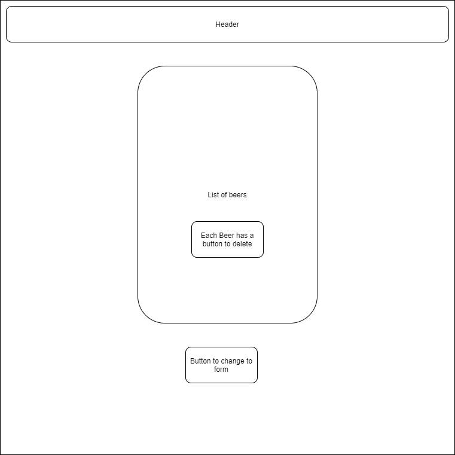

 # Beer Store

#### _Friday Practice _

#### By _StevenL July 3, 2020_

## Description

### _An app that lets you store beer and delete using React.js _

## Setup/Installation Requirements

* Clone this repository.
* npm start
* Open terminal and run dotnet build and dotnet run

## Specs
| Spec | Input | OutPut |
|:----------- | :-----------------| :---------------|
| User can add a beer | Input: Name="Coke", Brand="Coke",Price=5,Alcohol Content=34 | Output:Name="Coke", Brand="Coke",Price=5,Alcohol Content=34  |
| User can click to view details | *user click | Name="Coke", Brand="Coke",Price=5,Alcohol Content=34
| User can delete |*user click delete | *Beer gets deleted

## Known Bugs

No

## Support and contact details

If you have any suggestions or questions please message me on github

## Technologies Used

React.js
Jsx
Javascript
Html
Git
### License

This software is licensed under the MIT license.

Copyright (c) 2020 **_StevenLy_**